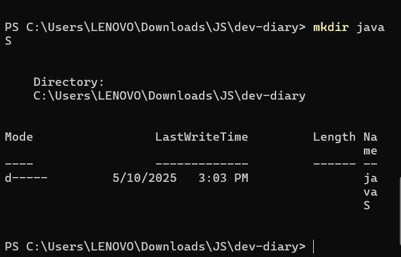
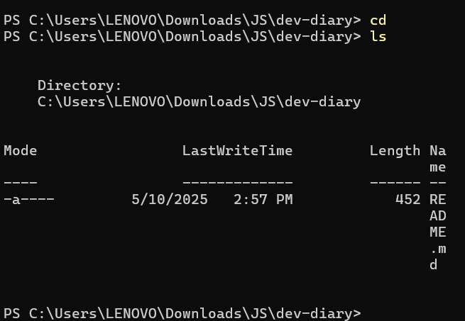
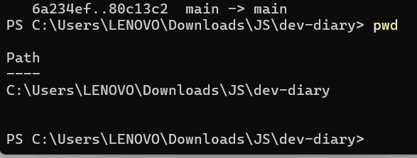

# dev-diary

## About Me
 Hi, My name is Linda Hashash. I'm working on this project to develop my skills while learning full stack programming.

 ## What I discovered regarding Markdown
 I gained knowledge about formatting content using code blocks, lists, links, bold, italics, and headings.

 ## My newfound knowledge of the command line
 Basic terminal commands like `cd`, `ls`, `pwd`, and `mkdir` were among the things I practiced.
 ### 📁 mkdir command

>>>>>>> HEAD
### 📂 cd and ls commands

### 📍 pwd command

 ## Equipment I use the Command Line, VS Code, Markdown, GitHub, and Git.
=======
## 🖼️ Command Line Screenshots

Here are some screenshots of the commands I practiced:

### 📁 mkdir command

### 📂 cd and ls commands

### 📍 pwd command

## Tools I'm using
Git, GitHub, VS Code, Markdown, Command Line.
>>>>>>> 194b143 (Added terminal screenshots to README)
