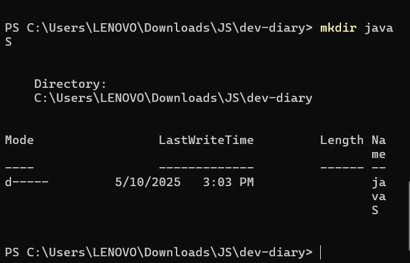
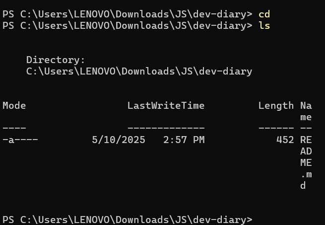
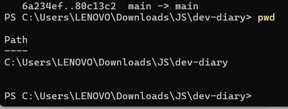

# dev-diary

## 👩‍💻 About Me

Hello! I'm **Linda Hashash**, a passionate software engineering student with a focus on *full stack development*.  
I enjoy solving problems, building user-friendly applications, and continuously learning new technologies.

## 🌱 What I Learned from the *Good Developer Mindset* Article  

I discovered that being **curious**, **open to learning**, and constantly honing your abilities are all components of a great development attitude.  
It also entails **accepting challenges** and **working well with others**.

## 💻 What I Learned from the *Terminal Command Cheat Sheet*  

I found that developers may more effectively engage with the system by using terminal commands.  
For file management and navigation in the terminal, commands like `cd`, `ls` and `mkdir` are crucial.

## 🖼️ Command Line Screenshots

Here are some screenshots of the commands I practiced:

### 📁 mkdir command

### 📂 cd and ls commands

### 📍 pwd command

## Tools I'm using

Git, GitHub, VS Code, Markdown, Command Line.
